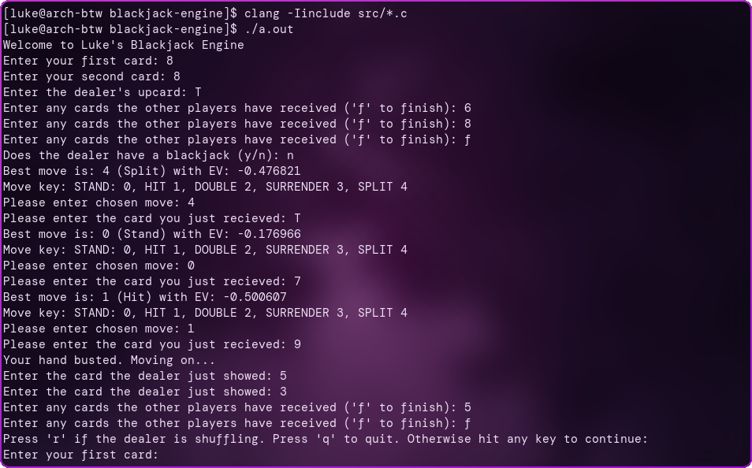

# Blackjack Engine

A C program that calculates and weighs all possible Blackjack outcomes in real time.

## Preview



## Usage

### Step 1: Clone & Compile

To clone the repo, run this command inside the desired folder:

```git clone https://github.com/lukedunwoody/blackjack-engine.git```

Inside the project folder, use the C compiler of your choice.

Here's a simple compile command using clang:

```clang -Iinclude src/*.c```

### Step 2: Launch Flags

The program takes a number of launch flags to ensure the calculator can give the most accurate results based on the specific rules of your game.

Each launch flag is used in the format `program_name -flag arg(s)`

Follow this table to match your exact rules to the launch flags:

|Rule               |Flag|Default|Range|
|-------------------|----|-------|-----|
|Number of decks    |-d  |8      |int  |
|Blackjack payout   |-p  |1.5    |float|
|Surrender allowed  |-s  |0      |0-1  |
|Insurance offered  |-i  |0      |0-1  |
|Dealer hits soft 17|-s17|0      |0-1  |
|Double after split |-das|1      |0-1  |
|Resplit split aces |-rsa|0      |0-1  |
|Play on split aces |-psa|0      |0-1  |
|Max Splits         |-ms |4      |>=8  |
|Double restrictions|-dr |None   |2-21 |
|Dealer peeks hole  |-dp |1      |0-1  |

### Step 3: Using the Program

After launching with the desired flags, follow the program's instructions to get extremely precise and fast best move and EV calculations.

When asked for a card, use the respective digit for each except for tens and face cards, where you must use either 'T', 'J', 'Q', or 'K'.

Additionally, you may use 'A' for aces, but '1' works too.

When asked for the chosen move, use the move-to-integer map printed at each prompt and enter the number of your chosen move.

When asked for dealer cards, the program will automatically stop asking when the dealer should no longer hit.

## Known Limitations

### Splitting calculations

Instead of accurately computing each split as its own path that happens independently in sequence, the program calculates the path of one split and assumes that result for both.

This results in a slight inaccuracy, but a massive performance gain as calculating both paths of every split would require iterating through 3 extra cards, which would quickly spike the compute cost because of recursion.

### Player knows hole card in pre_deal_ev

In pre_deal_ev, the dealer's hole card is chosen before simulating the EV of any moves.

This gives the player a massive advantage because hit or stand decisions are decided knowing the most optimal path for that specific hole card.

Iterating through the hole card during the dealer simulation would require losing the ability to detect early blackjacks, also making this version inaccurate.

The only fix would be a more complex hidden card system, but this is not a priority because pre_deal_ev is not needed for the main program.

## Test Scripts

Inside the [tests](tests) folder there are a variety of short and simple programs you can use to test the functionality of specific parts of the engine without launching the full program.

Keep the known limitations in mind when using these.
