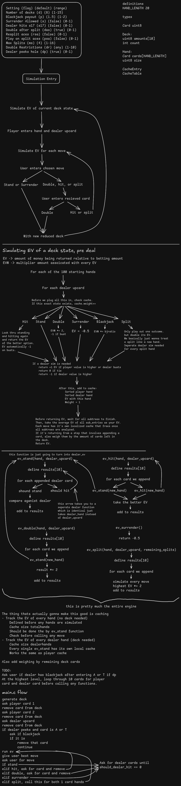

# Engine Design

The engine (located at `src/engine.c`) is where the bulk of the EV calculations during the Blackjack games take place.

Inside this folder the rough design sketches that helped visualize and plan EV engine implementation.

## Design Sketch

The `.excalidraw` can be opened at [excalidraw.com](https://excalidraw.com/) for detailed inspection and editing.

### Preview

<picture>
  <source media="(prefers-color-scheme: dark)" srcset="images/engine-design-dark-preview.svg">
  <source media="(prefers-color-scheme: light)" srcset="images/engine-design-light-preview.svg">
  
</picture>
