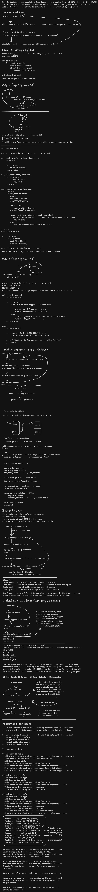

# Script Design

The seven scripts inside the scripts folder estimate the number of possible game states and simulations required by different parts of the engine. These calculations will be used to estimate the total workload at each deck state and determine whether additional optimizations are needed before implementing the full engine.

This is also my first project using C, so these scripts served as a way to learn the language, optimization, and conventions that will be used in the final implementation.

Inside this folder are also the rough design sketches that helped visualize and plan the simulation scripts before implementation, as well as explanations for what each script does and why it's helpful.

## Script Breakdowns

Detailed information for each script, in order of completion.

In this document, a state refers to a unique possible game situation that the final engine must evaluate.

### `unique_starthands_calc.c`

Calculates the number of unique two-card hands (starting hands) that can exist with no duplicates.

#### Role:
- Determine the number of different player trees before any cards are dealt.
- Determine the sizing of future two-card hand cache and LUT tables.

#### Personal Milestones:
- First working C program.
- First implementation of any form of caching in any language.

#### Result:

55 unique two-card hands.

### `hit_sims_calc.c`

Calculates the total number of possible states created by hitting, including duplicate calculations that would occur without caching.

This script is kept for comparison purposes to demonstrate the impact caching has. The optimized version is `cached_hit_states_calc.c`.

#### Result:

5,483,410 states per hit with no caching, for all 55 two-card hands.

### `split_sims_calc.c`

Calculates the total number of possible states created by splitting, including duplicate calculations that would occur without caching.

This script is kept for comparison purposes to demonstrate the impact caching and using LUTs has. The optimized version is `cached_split_states_calc.c`.

#### Result:

344,901,480 states per split with no caching or LUTs, for all 10 cards, with a maximum split limit of 4.

### `unique_totalhands_calc.c`

Calculates the number of possible player hands after removing duplicate hands and excluding states where additional actions cannot improve the result (for example, hitting on soft 21).

#### Role:

Determine the maximum size a cache table would need to be to store information for all possible hands in a normal array for speed.

#### Personal Milestones:

First implementation of linked list caching.

#### Result:

3,062 unique hands.

### `cached_hit_states_calc.c`

Calculates the number of non-bust outcome states a hit can create across all 55 starting hands.

#### Role:

Adds to the total number of maximum states the final engine will need to calculate to find the EV of a deck state before any cards are dealt, giving a rough estimate of how long the calculator will take.

#### Result:

3,007 unique states per hit, for all 55 two-card hands.

### `cached_split_states_calc.c`

Calculates the number of non-bust outcome states a split can create across all 10 splittable two-card hands.

#### Role:
Same as `cached_hit_states_calc.c`

#### Result:

12,635 unique states per split, for all 10 cards, with a maximum split limit of 4.

### `unique_dealerhands_calc.c`

Calculates the number of unique dealer outcomes that can occur after removing duplicate hands. Uses the same design as `unique_totalhands_calc.c`, just with altered logic for when to append a card.

#### Role:

Determines how many dealer states are required for each player state evaluation. The final state count is calculated by multiplying the number of possible player states by the number of possible dealer states.

#### Result:

2,375 unique dealer hands.

## What these numbers mean

Before any cards are dealt, there are 55 possible starting player hands. For each of these hands, the engine must evaluate every possible action. The maximum number of unique player outcomes created by each decision is:

- Hit: 3,007
- Stand: 55
- Double: 540
- Surrender: 54
- Split: 12,635

Total: 16,291

Each player state also requires evaluating every possible dealer outcome. Since there are 2,375 unique dealer states, the theoretical maximum workload before any other optimizations is:

```
  16,291 * 2,375
= 38,691,125 total simulations
```

## Accounting for decks

A key element I forgot during the creation of the original simulator was that every unique state also comes with not only a specific hand, but a specific deck. However, I had another realization after implementing it: the deck is just another way to represent the player's hand, so it actually makes no impact on the simulation amounts. Therefore, any references to this can be ignored in the scripts.

I also fixed a variety of bugs that were in the scripts before, which I only found because of the deck implementation, so that's good. I didn't realize that total hands > player hands > dealer hands. Now everything adds up; before, it didn't.

## Design Sketch

The `.excalidraw` can be opened at [excalidraw.com](https://excalidraw.com/) for detailed inspection and editing.

### Preview

<picture>
  <source media="(prefers-color-scheme: dark)" srcset="images/script-design-dark-preview.svg">
  <source media="(prefers-color-scheme: light)" srcset="images/script-design-light-preview.svg">
  
</picture>
